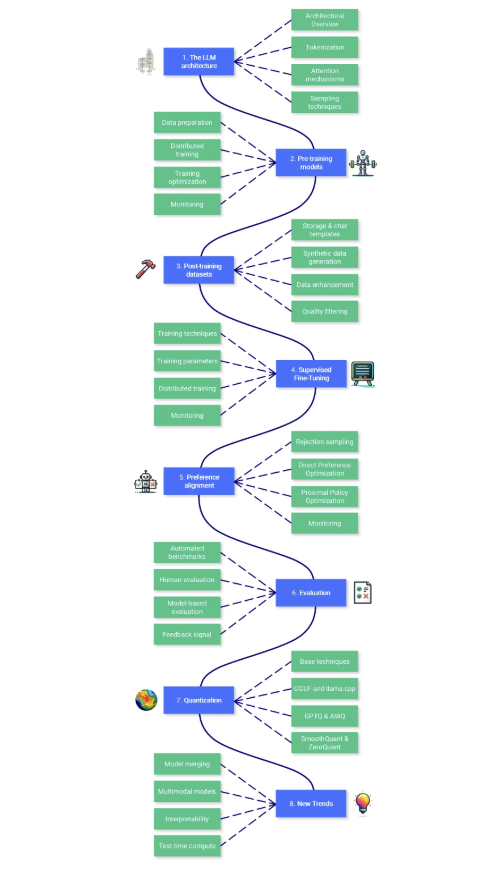
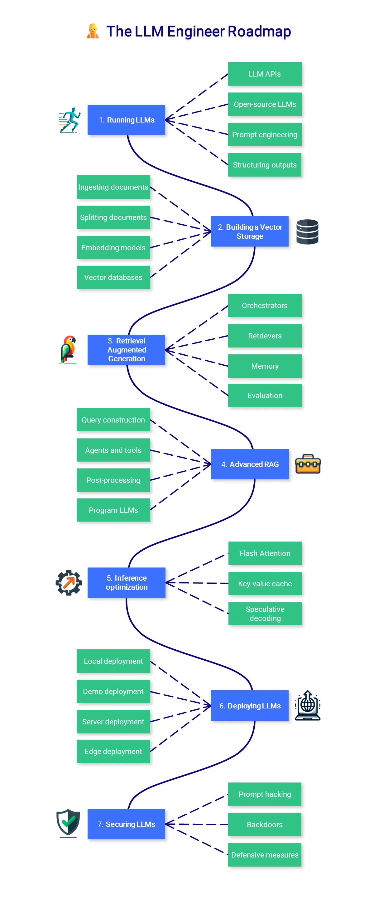

# The Large Language Model Course

The Large Language Model (LLM) course is a collection of topics and educational resources for people to get into LLMs. It features two main roadmaps:

1. 🧑‍🔬 The LLM Scientist focuses on building the best possible LLMs using the latest techniques.
2. 👷 The LLM Engineer focuses on creating LLM-based applications and deploying them.

## 🧑‍🔬 The LLM Scientist

This section of the course focuses on learning how to build the best possible LLMs using the latest techniques.

 

### 1. The LLM architecture
An in-depth knowledge of the Transformer architecture is not required, but it’s important to understand the main steps of modern LLMs: converting text into numbers through tokenization, processing these tokens through layers including attention mechanisms, and finally generating new text through various sampling strategies.

* Architectural Overview: Understand the evolution from encoder-decoder Transformers to decoder-only architectures like GPT, which form the basis of modern LLMs. Focus on how these models process and generate text at a high level.

* Tokenization: Learn the principles of tokenization — how text is converted into numerical representations that LLMs can process. Explore different tokenization strategies and their impact on model performance and output quality.

* Attention mechanisms: Master the core concepts of attention mechanisms, particularly self-attention and its variants. Understand how these mechanisms enable LLMs to process long-range dependencies and maintain context throughout sequences.

* Sampling techniques: Explore various text generation approaches and their tradeoffs. Compare deterministic methods like greedy search and beam search with probabilistic approaches like temperature sampling and nucleus sampling.

### 📚 References:

* <a href="https://www.youtube.com/watch?v=wjZofJX0v4M">Visual intro to Transformers</a> by 3Blue1Brown: Visual introduction to Transformers for complete beginners.

* <a href="https://bbycroft.net/llm">LLM Visualization</a> by Brendan Bycroft: Interactive 3D visualization of LLM internals.

* <a href="https://www.youtube.com/watch?v=kCc8FmEb1nY">nanoGPT</a> by Andrej Karpathy: A 2h-long YouTube video to reimplement GPT from scratch (for programmers). He also made a video about  <a href="https://www.youtube.com/watch?v=zduSFxRajkE">tokenization</a>.

* <a href="https://lilianweng.github.io/posts/2018-06-24-attention/">Attention? Attention!</a> by Lilian Weng: Historical overview to introduce the need for attention mechanisms.

* <a href="https://mlabonne.github.io/blog/posts/2023-06-07-Decoding_strategies.html">Decoding Strategies in LLMs</a> by Maxime Labonne: Provide code and a visual introduction to the different decoding strategies to generate text.

### 2. Pre-training models

Pre-training is a computationally intensive and expensive process. While it’s not the focus of this course, it’s important to have a solid understanding of how models are pre-trained, especially in terms of data and parameters. Pre-training can also be performed by hobbyists at a small scale with <1B models.

* Data preparation: Pre-training requires massive datasets (e.g., Llama 3.1 was trained on 15 trillion tokens) that need careful curation, cleaning, deduplication, and tokenization. Modern pre-training pipelines implement sophisticated filtering to remove low-quality or problematic content.

* Distributed training: Combine different parallelization strategies: data parallel (batch distribution), pipeline parallel (layer distribution), and tensor parallel (operation splitting). These strategies require optimized network communication and memory management across GPU clusters.

* Training optimization: Use adaptive learning rates with warm-up, gradient clipping and normalization to prevent explosions, mixed-precision training for memory efficiency, and modern optimizers (AdamW, Lion) with tuned hyperparameters.

* Monitoring: Track key metrics (loss, gradients, GPU stats) using dashboards, implement targeted logging for distributed training issues, and set up performance profiling to identify bottlenecks in computation and communication across devices.

### 📚 References:

* <a href="https://huggingface.co/spaces/HuggingFaceFW/blogpost-fineweb-v1">DFineWeb</a> by Penedo et al.: Article to recreate a large-scale dataset for LLM pretraining (15T), including FineWeb-Edu, a high-quality subset.

* <a href="https://www.together.ai/blog/redpajama-data-v2">RedPajama v2</a>  by Weber et al.: Another article and paper about a large-scale pre-training dataset with a lot of interesting quality filters.

* <a href="https://github.com/huggingface/nanotron">nanotron</a> by Hugging Face: Minimalistic LLM training codebase used to make <a href="https://github.com/huggingface/smollm">SmolLM2</a>.

* <a href="https://www.andrew.cmu.edu/course/11-667/lectures/W10L2%20Scaling%20Up%20Parallel%20Training.pdf">Parallel training</a>  by Chenyan Xiong: Overview of optimization and parallelism techniques.

* <a href="https://arxiv.org/abs/2407.20018">Distributed training</a>  by Duan et al.: A survey about efficient training of LLM on distributed architectures.

* <a href="https://allenai.org/olmo">OLMo 2</a> by AI2: Open-source language model with model, data, training, and evaluation code.

* <a href="https://www.llm360.ai/">LLM360</a> by LLM360: A framework for open-source LLMs with training and data preparation code, data, metrics, and models.

### 3. Post-training datasets:

Post-training datasets have a precise structure with instructions and answers (supervised fine-tuning) or instructions and chosen/rejected answers (preference alignment). Conversational structures are a lot rarer than the raw text used for pre-training, which is why we often need to process seed data and refine it to improve the accuracy, diversity, and complexity of the samples. More information and examples are available in my repo <a href="https://github.com/mlabonne/llm-datasets">💾 LLM Datasets.</a>

* Storage & chat templates: Because of the conversational structure, post-training datasets are stored in a specific format like ShareGPT or OpenAI/HF. Then, these formats are mapped to a chat template like ChatML or Alpaca to produce the final samples the model is trained on.

* Synthetic data generation: Create instruction-response pairs based on seed data using frontier models like GPT-4o. This approach allows for flexible and scalable dataset creation with high-quality answers. Key considerations include designing diverse seed tasks and effective system prompts.

* Data enhancement: Enhance existing samples using techniques like verified outputs (using unit tests or solvers), multiple answers with rejection sampling, Auto-Evol, Chain-of-Thought, Branch-Solve-Merge, personas, etc.

* Quality filtering: Traditional techniques involve rule-based filtering, removing duplicates or near-duplicates (with MinHash or embeddings), and n-gram decontamination. Reward models and judge LLMs complement this step with fine-grained and customizable quality control.

### 📚 References:

* <a href="https://huggingface.co/spaces/argilla/synthetic-data-generator">Synthetic Data Generator</a> by Argilla: Beginner-friendly way of building datasets using natural language in a Hugging Face space.

* <a href="https://github.com/mlabonne/llm-datasets">LLM Datasets</a>  by Maxime Labonne: Curated list of datasets and tools for post-training.

* <a href="https://github.com/NVIDIA/NeMo-Curator">NeMo-Curator</a>  by Nvidia: Dataset preparation and curation framework for pre and post-training data.

* <a href="https://distilabel.argilla.io/dev/sections/pipeline_samples/">Distilabel</a>  by Argilla: Framework to generate synthetic data. It also includes interesting reproductions of papers like UltraFeedback.

* <a href="https://github.com/MinishLab/semhash">Semhash</a> by MinishLab: Minimalistic library for near-deduplication and decontamination with a distilled embedding model.

* <a href="https://huggingface.co/docs/transformers/main/en/chat_templating">Chat Template</a>  by Hugging Face: Hugging Face’s documentation about chat templates.

### 4. Supervised Fine-Tuning

SFT turns base models into helpful assistants, capable of answering questions and following instructions. During this process, they learn how to structure answers and reactivate a subset of knowledge learned during pre-training. Instilling new knowledge is possible but superficial: it cannot be used to learn a completely new language. Always prioritize data quality over parameter optimization.

* Training techniques: Full fine-tuning updates all model parameters but requires significant compute. Parameter-efficient fine-tuning techniques like LoRA and QLoRA reduce memory requirements by training a small number of adapter parameters while keeping base weights frozen. QLoRA combines 4-bit quantization with LoRA to reduce VRAM usage.

* Training parameters: Key parameters include learning rate with schedulers, batch size, gradient accumulation, number of epochs, optimizer (like 8-bit AdamW), weight decay for regularization, and warmup steps for training stability. LoRA also adds three parameters: rank (typically 16–128), alpha (1–2x rank), and target modules.

* Distributed training: Scale training across multiple GPUs using DeepSpeed or FSDP. DeepSpeed provides three ZeRO optimization stages with increasing levels of memory efficiency through state partitioning. Both methods support gradient checkpointing for memory efficiency.

* Monitoring: Track training metrics including loss curves, learning rate schedules, and gradient norms. Monitor for common issues like loss spikes, gradient explosions, or performance degradation.

### 📚 References:

* <a href="https://huggingface.co/blog/mlabonne/sft-llama3">Fine-tune Llama 3.1 Ultra-Efficiently with Unsloth</a>  by Maxime Labonne: Hands-on tutorial on how to fine-tune a Llama 3.1 model using Unsloth.

* <a href="https://axolotl-ai-cloud.github.io/axolotl/">Axolotl — Documentation</a>  by Wing Lian: Lots of interesting information related to distributed training and dataset formats.

* <a href="https://parlance-labs.com/education/">Mastering LLMs</a>  by Hamel Husain: Collection of educational resources about fine-tuning (but also RAG, evaluation, applications, and prompt engineering).

* <a href="https://lightning.ai/pages/community/lora-insights/">LoRA insights</a> by Sebastian Raschka: Practical insights about LoRA and how to select the best parameters.

### 5. Preference Alignment

Preference alignment is a second stage in the post-training pipeline, focused on aligning generated answers with human preferences. This stage was designed to tune the tone of LLMs and reduce toxicity and hallucinations. However, it has become increasingly important to also boost their performance and improve usefulness. Unlike SFT, there are many preference alignment algorithms. Here, we’ll focus on the two most important ones: DPO and PPO.

* Rejection sampling: For each prompt, use the trained model to generate multiple responses, and score them to infer chosen/rejected answers. This creates on-policy data, where both responses come from the model being trained, improving alignment stability.
  
* <a href="https://arxiv.org/abs/2305.18290">Direct Preference Optimization</a>  Directly optimizes the policy to maximize the likelihood of chosen responses over rejected ones. It doesn’t require reward modeling, which makes it more computationally efficient than PPO but slightly worse in terms of quality.

* <a href="https://arxiv.org/abs/1707.06347">Proximal Policy Optimization</a> : Iteratively updates policy to maximize reward while staying close to initial behavior. It uses a reward model to score responses and requires careful tuning of hyperparameters including learning rate, batch size, and PPO clip range.
  
* Monitoring: In addition to SFT metrics, you want to maximize the margin between chosen and preferred answers. The accuracy should also gradually increase until it plateaus.

### 📚 References:

* <a href="https://huggingface.co/blog/rlhf">Illustrating RLHF</a> by Hugging Face: Introduction to RLHF with reward model training and fine-tuning with reinforcement learning.

* <a href="https://magazine.sebastianraschka.com/p/llm-training-rlhf-and-its-alternatives">LLM Training: RLHF and Its Alternatives</a>  by Sebastian Rashcka: Overview of the RLHF process and alternatives like RLAIF.

* <a href="https://huggingface.co/blog/pref-tuning">Preference Tuning LLMs</a> by Hugging Face: Comparison of the DPO, IPO, and KTO algorithms to perform preference alignment.

* <a href="https://mlabonne.github.io/blog/posts/Fine_tune_Mistral_7b_with_DPO.html">Fine-tune Mistral-7b with DPO</a>by Maxime Labonne: Tutorial to fine-tune a Mistral-7b model with DPO and reproduce NeuralHermes-2.5.

* <a href="https://wandb.ai/alexander-vishnevskiy/dpo/reports/TRL-Original-DPO--Vmlldzo1NjI4MTc4">DPO Wandb logs</a> by Alexander Vishnevskiy: It shows you the main metrics to track and the trends you should expect.

### 6. Evaluation

Reliably evaluating LLMs is a complex but essential task guiding data generation and training. It provides invaluable feedback about areas of improvement, which can be leveraged to modify the data mixture, quality, and training parameters. However, it’s always good to remember Goodhart’s law: “When a measure becomes a target, it ceases to be a good measure.”

* Automated benchmarks: Evaluate models on specific tasks using curated datasets and metrics, like MMLU. It works well for concrete tasks but struggles with abstract and creative capabilities. It is also prone to data contamination.
  
* Human evaluation: It involves humans prompting models and grading responses. Methods range from vibe checks to systematic annotations with specific guidelines and large-scale community voting (arena). It is more suited for subjective tasks and less reliable for factual accuracy.

* Model-based evaluation: Use judge and reward models to evaluate model outputs. It highly correlates with human preferences but suffers from bias toward their own outputs and inconsistent scoring.

* Feedback signal: Analyze error patterns to identify specific weaknesses, such as limitations in following complex instructions, lack of specific knowledge, or susceptibility to adversarial prompts. This can be improved with better data generation and training parameters.

### 📚 References:

* <a href="https://github.com/huggingface/evaluation-guidebook">Evaluation guidebook</a> by Clémentine Fourrier: Practical insights and theoretical knowledge about LLM evaluation.

* <a href="https://huggingface.co/spaces/open-llm-leaderboard/open_llm_leaderboard#/">Open LLM Leaderboard</a>  by Hugging Face: Main leaderboard to compare LLMs in an open and reproducible way (automated benchmarks).

* <a href="https://github.com/EleutherAI/lm-evaluation-harness">Language Model Evaluation Harness</a>  by EleutherAI: A popular framework for evaluating LLMs using automated benchmarks.

* <a href="https://github.com/huggingface/lighteval">Lighteval</a> by Hugging Face: Alternative evaluation framework that also includes model-based evaluations.

* <a href="https://lmarena.ai/">Chatbot Arena</a>  by LMSYS: Elo rating of general-purpose LLMs, based on comparisons made by humans (human evaluation).

### 7. Quantization

Quantization is the process of converting the parameters and activations of a model using a lower precision. For example, weights stored using 16 bits can be converted into a 4-bit representation. This technique has become increasingly important to reduce the computational and memory costs associated with LLMs.

* Base techniques: Learn the different levels of precision (FP32, FP16, INT8, etc.) and how to perform naïve quantization with absmax and zero-point techniques.
  
* GGUF & llama.cpp: Originally designed to run on CPUs, llama.cpp and the GGUF format have become the most popular tools to run LLMs on consumer-grade hardware. It supports storing special tokens, vocabulary, and metadata in a single file.

* GPTQ & AWQ: Techniques like GPTQ/EXL2 and AWQ introduce layer-by-layer calibration that retains performance at extremely low bitwidths. They reduce catastrophic outliers using dynamic scaling, selectively skipping or re-centering the heaviest parameters.

* SmoothQuant & ZeroQuant: New quantization-friendly transformations (SmoothQuant) and compiler-based optimizations (ZeroQuant) help mitigate outliers before quantization. They also reduce hardware overhead by fusing certain ops and optimizing dataflow.

### 📚 References:

* <a href="https://mlabonne.github.io/blog/posts/Introduction_to_Weight_Quantization.html">Introduction to quantization</a>  by Maxime Labonne: Overview of quantization, absmax and zero-point quantization, and LLM.int8() with code.

* <a href="https://mlabonne.github.io/blog/posts/Quantize_Llama_2_models_using_ggml.html">Quantize Llama models with llama.cpp</a>  by Maxime Labonne: Tutorial on how to quantize a Llama 2 model using llama.cpp and the GGUF format.

* <a href="https://mlabonne.github.io/blog/posts/4_bit_Quantization_with_GPTQ.html">4-bit LLM Quantization with GPTQ</a>  by Maxime Labonne: Tutorial on how to quantize an LLM using the GPTQ algorithm with AutoGPTQ.

* <a href="https://medium.com/friendliai/understanding-activation-aware-weight-quantization-awq-boosting-inference-serving-efficiency-in-10bb0faf63a8"> Understanding Activation-Aware Weight Quantization</a> by FriendliAI: Overview of the AWQ technique and its benefits.

* <a href="https://github.com/mit-han-lab/smoothquant/blob/main/examples/smoothquant_llama_demo.ipynb"> SmoothQuant on Llama 2 7B</a> by MIT HAN Lab: Tutorial on how to use SmoothQuant with a Llama 2 model in 8-bit precision.

* <a href="https://lmarena.ai/](https://www.deepspeed.ai/tutorials/model-compression/">DeepSpeed Model Compression</a>  by DeepSpeed: Tutorial on how to use ZeroQuant and extreme compression (XTC) with DeepSpeed Compression.

### 8. New Trends

Here are notable topics that didn’t fit into other categories. Some are established (model merging, multimodal) techniques, but others are more experimental (interpretability, test-time compute scaling) and the focus of numerous research papers.

* Model merging: Merging trained models has become a popular way of creating performant models without any fine-tuning. The popular mergekit library implements the most popular merging methods, like SLERP, DARE, and TIES.
  
* Multimodal models: These models (like CLIP, Stable Diffusion, or LLaVA) process multiple types of inputs (text, images, audio, etc.) with a unified embedding space, which unlocks powerful applications like text-to-image.

* Interpretability: Mechanistic interpretability techniques like Sparse Autoencoders (SAEs) made remarkable progress to provide insights about the inner workings of LLMs. This has also been applied with techniques such as abliteration, which allow you to modify the behavior of models without training.

* Test-time compute: Scaling the compute budget during test time requires numerous calls and involves specialized models like a Process Reward Model (PRM). Iterative steps with precise scoring significantly improve performance for complex reasoning tasks.

### 📚 References:

* <a href="https://mlabonne.github.io/blog/posts/2024-01-08_Merge_LLMs_with_mergekit.html">Merge LLMs with mergekit</a>  by Maxime Labonne: Tutorial about model merging using mergekit.

* <a href="https://github.com/merveenoyan/smol-vision">Smol Vision</a> by Merve Noyan: Collection of notebooks and scripts dedicated to small multimodal models.

* <a href="https://huyenchip.com/2023/10/10/multimodal.html">Large Multimodal Models</a>  by Chip Huyen: Overview of multimodal systems and the recent history of this field.

* <a href="https://huggingface.co/blog/mlabonne/abliteration">Unsensor any LLM with abliteration</a>  by Maxime Labonne: Direct application of interpretability techniques to modify the style of a model.

* <a href="https://adamkarvonen.github.io/machine_learning/2024/06/11/sae-intuitions.html">Intuitive Explanation of SAEs</a>  by Adam Karvonen: Article about how SAEs work and why they make sense for interpretability.

* <a href="https://huggingface.co/spaces/HuggingFaceH4/blogpost-scaling-test-time-compute">Scaling test-time compute</a>  by Beeching et al.: Tutorial and experiments to outperform Llama 3.1 70B on MATH-500 with a 3B model.

## 👷 The LLM Engineer

This section of the course focuses on learning how to build LLM-powered applications that can be used in production, with a focus on augmenting models and deploying them.

 

### 1. Running LLMs

Running LLMs can be difficult due to high hardware requirements. Depending on your use case, you might want to simply consume a model through an API (like GPT-4) or run it locally. In any case, additional prompting and guidance techniques can improve and constrain the output for your applications.

* LLM APIs: APIs are a convenient way to deploy LLMs. This space is divided between private LLMs (OpenAI, Google, Anthropic, Cohere, etc.) and open-source LLMs (OpenRouter, Hugging Face, Together AI, etc.).

* Open-source LLMs: The Hugging Face Hub is a great place to find LLMs. You can directly run some of them in Hugging Face Spaces, or download and run them locally in apps like LM Studio or through the CLI with llama.cpp or Ollama.

* Prompt engineering: Common techniques include zero-shot prompting, few-shot prompting, chain of thought, and ReAct. They work better with bigger models, but can be adapted to smaller ones.

* Structuring outputs: Many tasks require a structured output, like a strict template or a JSON format. Libraries like LMQL, Outlines, Guidance, etc. can be used to guide the generation and respect a given structure.

### 📚 References:

* <a href="https://www.kdnuggets.com/run-an-llm-locally-with-lm-studio">Run an LLM locally with LM Studio</a>  by Nisha Arya: Short guide on how to use LM Studio.

* <a href="https://www.promptingguide.ai/">Prompt engineering guide</a>  by DAIR.AI: Exhaustive list of prompt techniques with examples

* <a href="https://dottxt-ai.github.io/outlines/latest/quickstart/">Outlines — Quickstart</a> : List of guided generation techniques enabled by Outlines.

* <a href="https://lmql.ai/docs/language/overview.html">LMQL — Overview</a> : Introduction to the LMQL language.

### 2. Building a Vector Storage

### 3. Retrieval Augmented Generation

### 4. Advanced RAG

### 5. Inference optimization

### 6. Deploying LLMs

### 7. Securing LLMs

